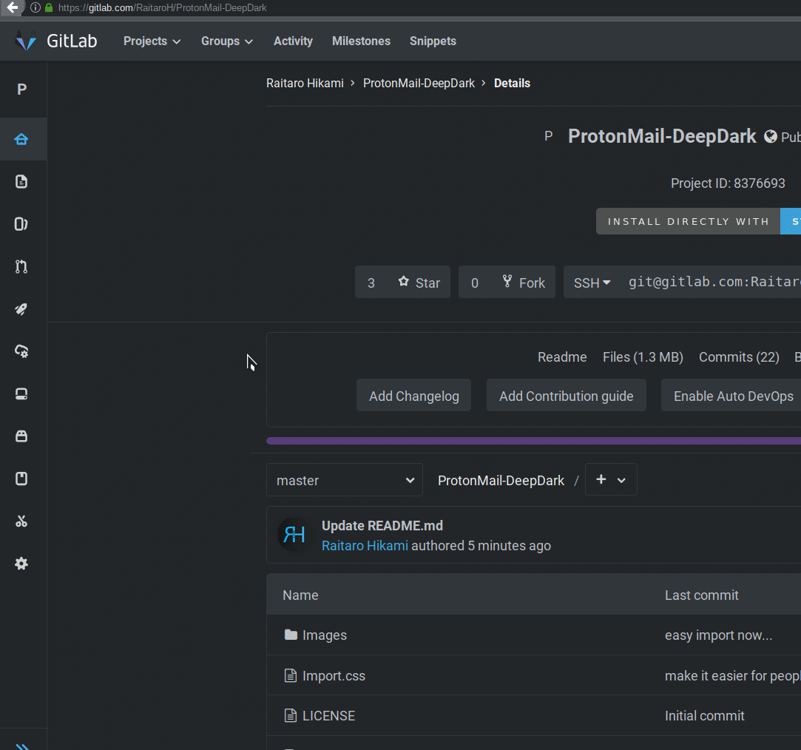

# ProtonMail-DeepDark

Emails should be written and read in the dark. May the dark be kinder on thine eyes. (ProtonMail dark theme)

This is a dark theme for ProtonMail inspired by [FT DeepDark](https://addons.mozilla.org/en-US/firefox/addon/ft-deepdark/?src=search). 

Also, credit where credit is due for the color palettes down bellow. ([@KDE](https://github.com/KDE), [@horst3180](https://github.com/horst3180), [@linuxmint](https://github.com/linuxmint), [Firefox](https://www.mozilla.org/en-US/firefox/new/), [YouTube](https://www.youtube.com/) and [Discord](https://discordapp.com/))

Theme as a userstyle [here](https://openusercss.org/theme/5b700d5f7d89ab0c00240396).

### **You can also install all my themes at once from [here](https://gitlab.com/RaitaroH/Import-All-Deepdark).**

# Install and setup

### Using a browser extension:
* Stylus - get the addon for [Firefox](https://addons.mozilla.org/en-US/firefox/addon/styl-us/), [Chrome](https://chrome.google.com/webstore/detail/stylus/clngdbkpkpeebahjckkjfobafhncgmne) and [Opera](https://addons.opera.com/en-gb/extensions/details/stylus/).

### Install this theme:  

  >Installs directly from this repository.  
  >This is only available using Stylus (see the [documentation](https://github.com/openstyles/stylus/wiki/Usercss)). :tada:

### Using the ProtonMail settings
  >~~This cannot be imported so you will have to copy the code from [here](https://gitlab.com/RaitaroH/ProtonMail-DeepDark/raw/master/ProtonMailDeepDark.user.css).~~  
  >~~If is too long, delete everything until you get to `@moz`. If even that is too much, delete everything in between `/**/` inside `:root`.~~  
  >~~Also **DO NOT** forget to replace the variables in `:root` (`/*[[mainColor]]*/` this stuff) with a set I provide just bellow `--shadow` for the theme to actually work.~~  

##### **BETTER JUST COPY PASTE FROM** [HERE](https://gitlab.com/RaitaroH/ProtonMail-DeepDark/raw/master/Import.css).

# Screenshots

# Colors 
The colors are available in the code; different colors can be used. Here are just a few colors. For every color example please look [here](https://github.com/OpenUserCSS/OpenUserCSS-DeepDark#colors).

For EVEN MORE color themes I also have a separate script [here](https://gitlab.com/RaitaroH/Import-All-Deepdark/raw/master/switcher.user.css).
